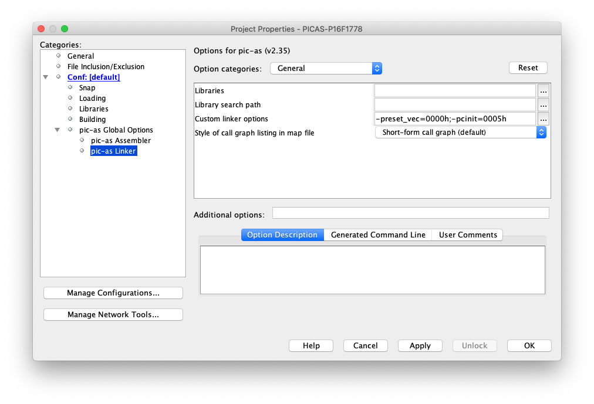

# ROBOT - TBOT 2 Wheels.

## Code.

- [Configuration](https://github.com/tronixio/robot-tbot/blob/main/Code/configuration.s)
- [EUSART TX](https://github.com/tronixio/robot-tbot/blob/main/Code/eusart.s)
- [ADC/TIMER0 - Read Battery](https://github.com/tronixio/robot-tbot/blob/main/Code/adc.s)
- [PWM - RC Servo & Interrupts Emergency](https://github.com/tronixio/robot-tbot/blob/main/Code/pwm.s)
- [IOC - Sharp GP2Y0D21YK](https://github.com/tronixio/robot-tbot/blob/main/Code/gp2y0d21yk.s)

## MPLABX Linker Configuration.

- PIC-AS Linker > Custom linker options:
  - For Configuration: `-preset_vec=0000h, -pcinit=0005h`
  - For EUSART TX & ADC/TIMER0: `-preset_vec=0000h, -pcinit=0005h, -pstringtext=3FC0h`
  - For PWM & IOC: `-preset_vec=0000h, -pintentry=0004h, -pcinit=0005h`

## Notes.

- TODO : Work in progress, prototype was not good, hardware, PCB and code can be rework.
- DRAFT : Prototype OK, last check schematic, PCB & code can be modify.

## DISCLAIMER.

THIS CODE IS PROVIDED WITHOUT ANY WARRANTY OR GUARANTEES.
USERS MAY USE THIS CODE FOR DEVELOPMENT AND EXAMPLE PURPOSES ONLY.
AUTHORS ARE NOT RESPONSIBLE FOR ANY ERRORS, OMISSIONS, OR DAMAGES THAT COULD
RESULT FROM USING THIS FIRMWARE IN WHOLE OR IN PART.

---
